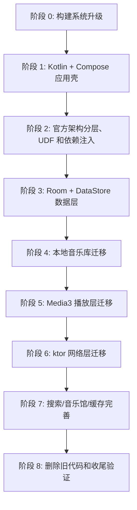
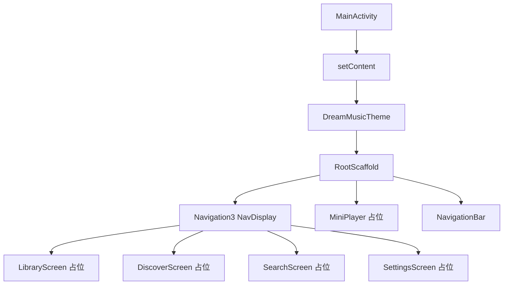
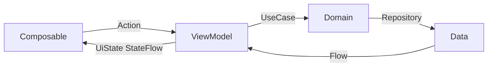
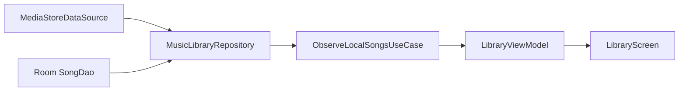
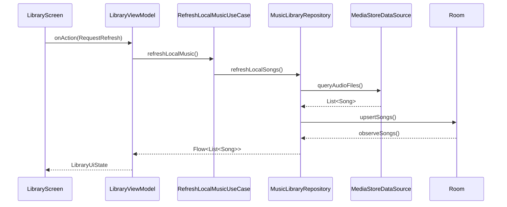
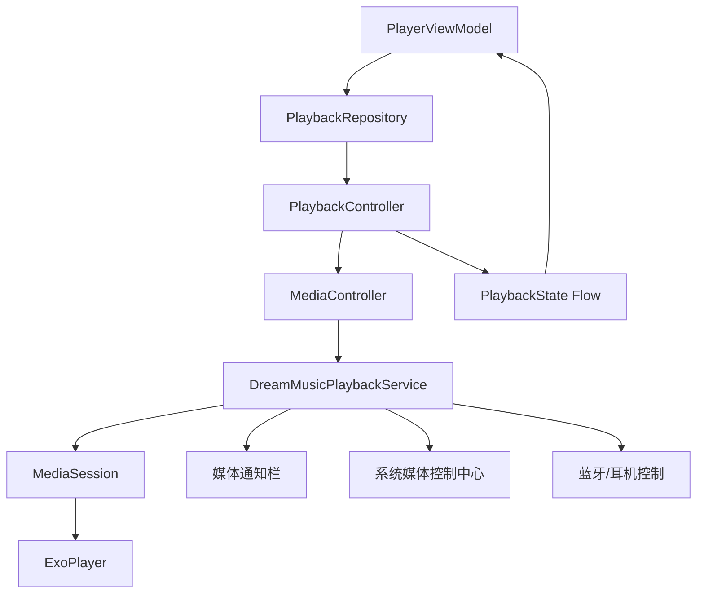
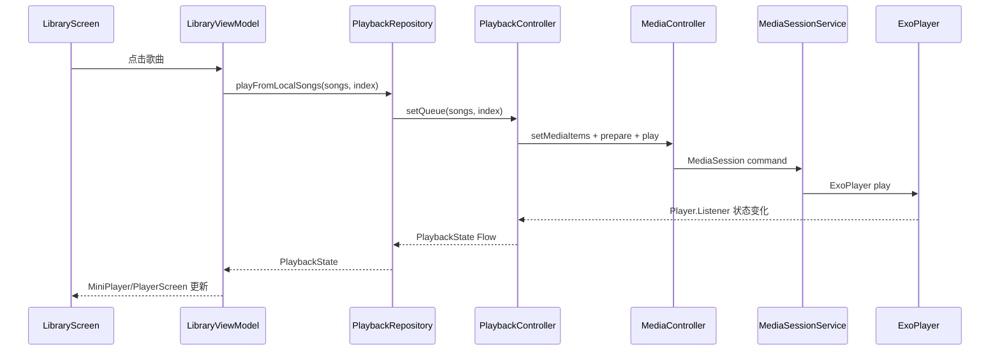

文章标题：DreamMusic Android 现代化改造实施计划

# 一、实施目标

本计划基于《DreamMusic Android 现代化改造概要设计文档》，正式确认底层播放器使用 Jetpack Media3，不再沿用原项目的 `MediaPlayer + Service + LocalBroadcastManager` 方案。

本次改造的目标是把 DreamMusic 从早期 Java/XML Android 项目升级为现代 Android 工程：

- 构建系统升级到 Gradle Wrapper 9.5.1
- JDK 使用本地已安装的 JDK 21.0.11
- Android Gradle Plugin 使用稳定版 9.2.1
- 编程语言迁移到 Kotlin
- UI 迁移到 Jetpack Compose + Material3
- 单 Activity 架构，页面导航使用 Jetpack Navigation3
- 架构对齐 Google 官方推荐方案，参考 NowInAndroid 的分层、模块化、UDF 和 offline-first 思路
- 数据存储使用 Room + DataStore
- 网络请求使用 ktor
- 异步和多线程统一使用 Kotlin 协程 + Flow
- 架构使用 MVVM，并引入 Repository / UseCase 分层
- 播放底层使用 Jetpack Media3，包括 ExoPlayer、MediaSessionService、媒体通知栏和系统媒体控制

本计划仍然不直接修改业务代码。它用于后续实施时逐步执行、逐步验证，避免一次性大改导致项目长期不可运行。

# 二、总体改造策略

这次升级跨度非常大，从 Gradle 2.14.1、AGP 2.2.3、Java、XML、Support Library，跨到 Gradle 9、AGP 9、Kotlin、Compose、AndroidX、Media3。如果直接全删重写，风险很高。

推荐采用“先建立现代工程骨架，再逐步迁移功能”的策略。

核心原则：

1. 每个阶段结束时项目都应该可以编译。
2. 每个阶段只解决一类问题，不混在一起做。
3. 先搭 Kotlin + Compose + MVVM 新壳，再迁移本地音乐、播放器和网络功能。
4. 新代码不依赖旧的 `MyApplication` 静态状态。
5. 旧 Java/XML 代码可以短期保留，但新功能不再往旧结构里加。
6. 播放器优先保证本地歌曲播放，再补网络播放、队列、通知栏和播放历史。
7. 网络音乐源接口化，旧百度音乐接口只作为一个 remote datasource 实现，不写死到 UI。

整体路线：




## 分阶段构建验证补充

补充要求确认：改造必须分阶段进行，每一阶段都要制定计划、任务、验证环节，并保证能编译成功、构建出 APK。

因此后续每个阶段必须包含：

- 阶段目标：这一阶段解决什么问题。
- 文件清单：新增、修改、删除哪些文件。
- 任务拆分：按小步执行，避免一次性大改。
- 验证命令：至少执行 `./gradlew :app:assembleDebug`。
- APK 产物检查：确认 `app/build/outputs/apk/debug/app-debug.apk` 存在。
- 回滚点：阶段开始前或完成后保留 git diff/commit，方便回退。

每个阶段的最低验收命令统一为：

```bash
./gradlew :app:assembleDebug
test -f app/build/outputs/apk/debug/app-debug.apk
```

如果涉及单元测试、Lint 或特定功能，再增加：

```bash
./gradlew :app:testDebugUnitTest
./gradlew :app:lintDebug
```

# 三、阶段 0：构建系统升级

## 目标

把项目从旧 Gradle/AGP 升级到现代 Android 构建基线，让项目可以在本地 JDK 21 下构建。

## 当前状态

已检测到：

```text
当前 Gradle Wrapper: gradle-2.14.1-all.zip
系统 Gradle: 未安装
当前 JDK: OpenJDK 21.0.11
```

由于系统没有全局 Gradle，后续升级以 Gradle Wrapper 为准。

## 应用包名补充

补充要求确认：应用包名统一修改为：

```text
com.sharpcj.dreammusic
```

迁移时需要同时处理：

- Gradle `namespace`
- Gradle `applicationId`
- AndroidManifest 中旧 package/组件引用
- Kotlin 源码包路径
- Hilt、Room、Media3 Service 等生成代码相关包路径
- 测试代码包路径
- 旧 Java 包 `com.example.sharpcj.dreammusic` 到新包名 `com.sharpcj.dreammusic` 的迁移

建议新代码全部放在 `app/src/main/java/com/sharpcj/dreammusic` 下，旧 Java 代码在迁移阶段可以短期保留，最终统一删除或迁移。

## 推荐版本

| 项目 | 版本 |
|---|---:|
| JDK | 21.0.11 |
| Gradle Wrapper | 9.5.1 |
| Android Gradle Plugin | 9.2.1 |
| Kotlin | 2.4.0 |

## 需要修改的文件

```text
gradle/wrapper/gradle-wrapper.properties
settings.gradle -> settings.gradle.kts
build.gradle -> build.gradle.kts
app/build.gradle -> app/build.gradle.kts
gradle.properties
```

## 主要任务

### 升级 Gradle Wrapper

修改：

```text
gradle/wrapper/gradle-wrapper.properties
```

目标：

```properties
distributionUrl=https\://services.gradle.org/distributions/gradle-9.5.1-bin.zip
```

注意：旧 wrapper jar 可能太老，必要时需要下载新 Gradle wrapper jar 或用临时 Gradle 分发包执行 wrapper 任务。

### 迁移 Gradle Kotlin DSL

把 Groovy DSL 文件迁移为 Kotlin DSL：

```text
settings.gradle -> settings.gradle.kts
build.gradle -> build.gradle.kts
app/build.gradle -> app/build.gradle.kts
```

旧写法：

```gradle
compile 'com.android.support:appcompat-v7:25+'
testCompile 'junit:junit:4.12'
```

新写法应使用：

```kotlin
implementation(...)
testImplementation(...)
```

并删除 Support Library 依赖，改用 AndroidX。

### 配置 Java/Kotlin toolchain

在 app 模块中统一设置：

```kotlin
compileOptions {
    sourceCompatibility = JavaVersion.VERSION_21
    targetCompatibility = JavaVersion.VERSION_21
}

kotlin {
    jvmToolchain(21)
}
```

## 验收命令

```bash
./gradlew --version
./gradlew :app:tasks
./gradlew :app:assembleDebug
test -f app/build/outputs/apk/debug/app-debug.apk
```

预期：

- `./gradlew --version` 显示 Gradle 9.5.1
- JDK 显示 21.0.11
- `:app:assembleDebug` 可以成功构建 debug APK
- `app/build/outputs/apk/debug/app-debug.apk` 文件存在
- 不再报 `Could not determine java version from '21.0.11'`

# 四、阶段 1：Kotlin + Compose 应用壳

## 目标

建立新的 Compose 应用入口，先跑通一个空壳 App，为后续页面迁移做基础。

## 需要新增或修改的文件

```text
app/src/main/AndroidManifest.xml
app/src/main/java/com/example/sharpcj/dreammusic/DreamMusicApp.kt
app/src/main/java/com/example/sharpcj/dreammusic/MainActivity.kt
app/src/main/java/com/example/sharpcj/dreammusic/core/navigation/DreamMusicNavKey.kt
app/src/main/java/com/example/sharpcj/dreammusic/core/navigation/DreamMusicNavDisplay.kt
app/src/main/java/com/example/sharpcj/dreammusic/core/navigation/TopLevelDestination.kt
app/src/main/java/com/example/sharpcj/dreammusic/core/navigation/NavigationActions.kt
app/src/main/java/com/example/sharpcj/dreammusic/core/designsystem/theme/Theme.kt
app/src/main/java/com/example/sharpcj/dreammusic/core/designsystem/theme/Color.kt
app/src/main/java/com/example/sharpcj/dreammusic/core/designsystem/theme/Type.kt
```

## 新增依赖方向

- Compose BOM
- Compose UI
- Compose Material3
- Compose Tooling Preview
- Activity Compose
- Navigation3 Runtime
- Navigation3 UI
- Lifecycle ViewModel Navigation3
- Lifecycle ViewModel Compose

## 页面壳结构



## 主页面建议

底部导航先建立四个入口：

- 本地音乐
- 音乐馆
- 搜索
- 设置

“设置”可以承接旧项目里的“更多”。如果你希望保留旧文案，也可以改成：

- 我的音乐
- 音乐馆
- 搜索
- 更多

## 验收命令

```bash
./gradlew :app:assembleDebug
test -f app/build/outputs/apk/debug/app-debug.apk
```

验收标准：

- App 可以编译并生成 `app/build/outputs/apk/debug/app-debug.apk`
- `MainActivity.kt` 使用 Compose `setContent {}`
- 可以看到底部导航和占位页面
- App 只有 `MainActivity` 一个 Activity 作为页面入口
- 页面切换走 Navigation3 back stack / NavDisplay
- 旧 `MainFragment` 不再作为主入口

# 五、阶段 2：Google 官方架构分层、UDF 和依赖注入

## 目标

搭建符合 Google 官方推荐架构的分层骨架，参考 NowInAndroid 的工程组织方式，为功能迁移提供稳定边界。这里的 MVVM 不是传统“Activity/Fragment + ViewModel”模式，而是 Compose + ViewModel + StateFlow + 单向数据流。

## 推荐包结构

参考 NowInAndroid 的 `core:*` 和 `feature:*` 模块边界。第一阶段先在单 app 模块内按未来多模块结构组织，保证改造可控；构建稳定后再拆 Gradle 多模块：

```text
com.sharpcj.dreammusic
├── core
│   ├── common
│   ├── model
│   ├── database
│   ├── datastore
│   ├── network
│   ├── media
│   └── data
└── feature
    ├── library
    ├── discover
    ├── search
    ├── player
    └── settings
```

后续如果要拆多模块，可以平滑迁移。

## 依赖注入方案

建议使用 Hilt。

原因：

- 能管理 Room Database、Dao、Repository、ktor HttpClient、DataStore、Media3 播放控制器
- 与 ViewModel、Navigation3/Lifecycle 集成成熟
- 比手动 Service Locator 更适合这个项目后续扩展

## 需要新增的基础类型

```text
core/common/result/AppResult.kt
core/common/error/AppError.kt
core/common/dispatcher/AppDispatchers.kt
core/model/Song.kt
core/model/Album.kt
core/model/Artist.kt
core/model/Playlist.kt
core/model/PlayMode.kt
core/model/PlaybackState.kt
```

## 单向数据流设计规范

所有页面遵循 Google 官方架构推荐的 UDF：



要求：

- Composable 只读取 `UiState`，只发送 `Action`。
- ViewModel 不持有 Android View，不直接访问 Dao、ktor、MediaStore 或 Media3。
- Repository 屏蔽数据源细节。
- Room 作为可缓存业务数据的单一事实来源。
- DataStore 保存用户偏好。
- 网络同步、媒体库扫描、播放状态都通过 Flow 回到 UI。

## ViewModel 设计规范

每个 feature 建议使用统一结构：

```text
feature/library
├── LibraryRoute.kt
├── LibraryScreen.kt
├── LibraryViewModel.kt
├── LibraryUiState.kt
├── LibraryAction.kt
└── components
```

ViewModel 对外只暴露：

```kotlin
val uiState: StateFlow<LibraryUiState>
fun onAction(action: LibraryAction)
```

Compose 不直接调用 Repository。

# 六、阶段 3：Room + DataStore 数据层

## 目标

建立本地持久化能力，替代原来的 `MyApplication` 静态列表和 `SystemUtil` SharedPreferences。

## Room 设计

建议新增：

```text
core/database/DreamMusicDatabase.kt
core/database/entity/SongEntity.kt
core/database/entity/ArtistEntity.kt
core/database/entity/AlbumEntity.kt
core/database/entity/PlaylistEntity.kt
core/database/entity/PlaylistSongEntity.kt
core/database/entity/PlaybackHistoryEntity.kt
core/database/entity/FavoriteSongEntity.kt
core/database/dao/SongDao.kt
core/database/dao/ArtistDao.kt
core/database/dao/AlbumDao.kt
core/database/dao/PlaylistDao.kt
core/database/dao/PlaybackHistoryDao.kt
```

最小可落地版本可以先只做：

```text
SongEntity
SongDao
DreamMusicDatabase
```

后续再补 artist、album、playlist、history。

## DataStore 设计

建议新增：

```text
core/datastore/UserPreferences.kt
core/datastore/UserPreferencesDataSource.kt
core/datastore/PreferencesKeys.kt
```

保存：

- 播放模式
- 主题模式
- 最近播放歌曲 ID
- 最近播放位置
- 本地音乐排序方式
- 首次启动标记

## Repository 设计

新增接口和实现：

```text
core/data/repository/MusicLibraryRepository.kt
core/data/repository/SettingsRepository.kt
core/data/repository/impl/DefaultMusicLibraryRepository.kt
core/data/repository/impl/DefaultSettingsRepository.kt
```

数据流：



# 七、阶段 4：本地音乐库迁移

## 目标

把原来的 `LocalMusicUtils + MyApplication.mlstMediaStoreSong + LocalSongFragment` 迁移到 Compose + Repository + Room。

## 新结构

```text
core/data/source/local/MediaStoreDataSource.kt
core/data/mapper/MediaStoreSongMapper.kt
feature/library/LibraryViewModel.kt
feature/library/LibraryScreen.kt
feature/library/components/SongList.kt
feature/library/components/PermissionRequiredContent.kt
```

## 权限设计

Android 13+：

```text
android.permission.READ_MEDIA_AUDIO
```

Android 12 及以下：

```text
android.permission.READ_EXTERNAL_STORAGE
```

进入本地音乐页面时检查权限，不再在 `Application.onCreate()` 阶段直接扫描。

## 本地音乐扫描流程



## 验收标准

- 未授权时展示权限说明
- 授权后扫描本地音乐
- 扫描结果写入 Room
- Compose 页面能展示歌曲列表
- 不再依赖 `MyApplication.mlstMediaStoreSong`

# 八、阶段 5：Jetpack Media3 播放层迁移

## 目标

使用 Jetpack Media3 替代原来的 `MusicPlayService + MediaPlayer + Timer + LocalBroadcastManager`。

## 核心依赖

建议引入：

```text
androidx.media3:media3-exoplayer
androidx.media3:media3-session
androidx.media3:media3-ui
```

`media3-ui` 不是 Compose UI，但可以保留用于调试或特殊场景。正式 UI 仍然使用 Compose 自定义播放器。

## 新播放模块结构

```text
core/media
├── DreamMusicPlaybackService.kt
├── PlaybackController.kt
├── MediaItemMapper.kt
├── PlaybackStateObserver.kt
├── PlaybackNotificationProvider.kt
└── di/MediaModule.kt
```

## Media3 播放架构



## 播放状态模型

建议定义：

```text
PlaybackState
├── currentSong: Song?
├── queue: List<Song>
├── currentIndex: Int
├── isPlaying: Boolean
├── durationMs: Long
├── positionMs: Long
├── bufferedPositionMs: Long
├── playMode: PlayMode
└── error: PlaybackError?
```

## 播放控制接口

```text
PlaybackController
├── observePlaybackState(): Flow<PlaybackState>
├── setQueue(queue: List<Song>, startIndex: Int)
├── play(song: Song)
├── playAt(index: Int)
├── pause()
├── resume()
├── seekTo(positionMs: Long)
├── skipToNext()
├── skipToPrevious()
└── setPlayMode(playMode: PlayMode)
```

## 原播放链路迁移映射

| 原逻辑 | 新逻辑 |
|---|---|
| `PlayerController.playLocalSong()` | `PlaybackController.setQueue()` + `playAt()` |
| `MusicPlayService` | `DreamMusicPlaybackService : MediaSessionService` |
| `MediaPlayer` | `ExoPlayer` |
| `LocalBroadcastManager` | `PlaybackState Flow` |
| `Timer` 每秒广播进度 | 协程定时采样 Player position，暴露 Flow |
| `MyApplication.isPlayerPlaying` | `PlaybackState.isPlaying` |
| `MyApplication.localPositionInlist` | `PlaybackState.currentIndex` |
| `MainActivity` 底部播放器 | `MiniPlayer` Composable |
| `PlayerActivity` | `PlayerScreen` Composable |

## 播放流程



## 验收标准

- 点击本地歌曲后能播放
- MiniPlayer 显示歌曲名、歌手、播放状态
- PlayerScreen 支持播放、暂停、上一首、下一首、seek
- 后台播放时显示媒体通知栏
- 锁屏和系统媒体控制可以控制播放
- 不再使用旧 `MusicPlayService`

# 九、阶段 6：ktor 网络层迁移

## 目标

用 ktor 替代 `HttpNet` 和部分手写线程逻辑，把网络音乐能力封装为可替换的数据源。

## 新结构

```text
core/network
├── DreamMusicHttpClient.kt
├── NetworkResult.kt
├── NetworkErrorMapper.kt
├── dto
│   ├── BillboardDto.kt
│   ├── SongLinkDto.kt
│   ├── HotSearchDto.kt
│   └── PlaylistDto.kt
└── datasource
    ├── RemoteMusicDataSource.kt
    ├── BaiduMusicRemoteDataSource.kt
    └── BaiduMusicHtmlDataSource.kt
```

## 网络音乐源接口

```text
RemoteMusicDataSource
├── getBillboard(type, page, pageSize)
├── getSongPlayableUrl(songId)
├── getHotSearchKeywords()
├── getFeaturedBanners()
└── getRecommendedPlaylists()
```

## 风险说明

原项目使用的百度音乐接口和网页抓取都很旧。后续实现时，如果接口失效，应保证：

- UI 不崩溃
- Repository 返回明确错误状态
- 页面展示错误提示和重试按钮
- 数据源实现可替换

## 验收标准

- ktor client 初始化成功
- 榜单请求能得到成功或明确失败结果
- 网络异常不会导致崩溃
- DiscoverScreen 能展示加载中、成功、失败、空状态

# 十、阶段 7：搜索、音乐馆和缓存完善

## 目标

迁移旧的搜索、精选、推荐歌单、榜单功能，并补齐原项目未完成的能力。

## 搜索功能

原项目 `SearchFagment` 只展示热门搜索标签，没有完整搜索结果页。

新设计：

```text
feature/search
├── SearchScreen.kt
├── SearchViewModel.kt
├── SearchUiState.kt
├── SearchAction.kt
└── components
    ├── HotKeywordSection.kt
    ├── SearchInput.kt
    └── SearchResultList.kt
```

能力：

- 展示热门搜索
- 支持输入关键词
- 展示搜索结果
- 点击结果播放
- 搜索历史保存到 Room

## 音乐馆功能

原项目音乐馆包括：

- 精选轮播图
- 推荐歌单
- 热歌榜
- 新歌榜
- 经典老歌榜
- 网络歌曲榜

新设计：

```text
feature/discover
├── DiscoverScreen.kt
├── DiscoverViewModel.kt
├── DiscoverUiState.kt
├── DiscoverAction.kt
└── components
    ├── BannerCarousel.kt
    ├── PlaylistGrid.kt
    ├── BillboardTabs.kt
    └── BillboardSongList.kt
```

缓存策略：

- 榜单数据可以缓存到 Room
- 首页轮播和歌单可以短期缓存
- 失败时优先展示缓存，并提示数据可能不是最新

# 十一、阶段 8：删除旧代码和收尾验证

## 目标

当新架构功能覆盖旧功能后，删除旧 Java/XML/Support Library 代码，避免双架构长期共存。

## 可删除范围

确认功能迁移完成后，逐步删除：

```text
base/BaseActivity.java
base/Base2Activity.java
base/BaseFragment.java
common/adapter/CommonAdapter.java
common/adapter/ViewHolder.java
common/net/HttpNet.java
common/thread/ThreadTask.java
jiuguoutils/LocalMusicUtils.java
jiuguoutils/BaiduMusicUtils.java
jiuguoutils/PlayerController.java
module/main/MusicPlayService.java
module/main/ui/PlayerActivity.java
module/main/ui/MainFragment.java
module/localmusic/*.java
module/musichall/*.java
module/search/*.java
大量旧 XML layout
```

注意：删除前需要确认 Compose 版本已有对应能力。

## 最终验收命令

```bash
./gradlew clean
./gradlew :app:assembleDebug
./gradlew :app:testDebugUnitTest
./gradlew :app:lintDebug
```

如果项目配置了 connected test，再执行：

```bash
./gradlew :app:connectedDebugAndroidTest
```

# 十二、实施顺序清单

建议后续实际动代码时，按这个顺序推进：

1. 升级 Gradle Wrapper 到 9.5.1。
2. 迁移 Gradle Kotlin DSL。
3. 接入 AGP 9.2.1、Kotlin 2.4.0。
4. 建立最小 Compose App，保证 `assembleDebug` 通过。
5. 引入 Hilt，但只注入最小对象，避免一开始复杂化。
6. 新建 core/model，定义 Song、Artist、Album、PlayMode、PlaybackState。
7. 新建 Room Database，只先实现 SongEntity/SongDao。
8. 新建 DataStore，保存播放模式和主题。
9. 新建 LibraryScreen，完成权限请求和本地音乐扫描。
10. 把扫描结果写入 Room，并通过 Flow 展示到 Compose。
11. 引入 Media3，建立 DreamMusicPlaybackService。
12. 建立 PlaybackController，支持播放本地歌曲。
13. 建立 MiniPlayer 和 PlayerScreen。
14. 支持播放队列、上一首、下一首、seek。
15. 引入 ktor，迁移榜单和热门搜索。
16. 完成 DiscoverScreen 和 SearchScreen。
17. 删除旧 Java/XML 代码。
18. 做一次完整构建、Lint、功能回归。

# 十三、建议先执行的第一批代码任务

后续如果你确认开始实施，我建议第一批只做“构建和空壳”，不要直接碰播放器。

第一批任务：

1. 升级 Gradle Wrapper。
2. 改造根 Gradle 配置。
3. 改造 app Gradle 配置。
4. 删除旧 Support Library 依赖。
5. 接入 Kotlin、Compose、Material3。
6. 创建新的 `MainActivity.kt`。
7. 创建 Compose Theme 和 Navigation3 NavDisplay。
8. 保留旧 Java 文件但不再作为入口。
9. 执行 `./gradlew :app:assembleDebug` 验证。

这样可以先把现代工程基础打稳，再进入本地音乐和 Media3 播放器迁移。

# 十四、阶段性提交建议

建议每个阶段单独提交，方便回滚：

```text
docs: add modernization design docs
build: upgrade gradle and android plugin
feat: add compose app shell
feat: add mvvm package skeleton
feat: add room and datastore foundation
feat: migrate local music library
feat: add media3 playback service
feat: migrate discover network layer to ktor
refactor: remove legacy java xml architecture
```

# 十五、下一步

如果你确认开始实施，我将从阶段 0 开始，先升级 Gradle/JDK/AGP/Kotlin 构建基线，并在每一步执行真实命令验证。

第一阶段完成的标准是：

```bash
./gradlew --version
./gradlew :app:assembleDebug
test -f app/build/outputs/apk/debug/app-debug.apk
```

都可以在当前机器上跑通，并且真实生成 debug APK。