文章标题：DreamMusic Android 现代化改造概要设计文档

# 一、设计背景

DreamMusic 当前是一个早期 Android 音乐播放器项目，核心功能包括本地音乐扫描、本地播放、百度音乐榜单浏览、网络歌曲播放、热门搜索展示、歌单和轮播图抓取等。项目代码整体偏教学 Demo 风格，使用 Java、Support Library、ViewPager、MediaPlayer、LocalBroadcastManager、AsyncTask、Thread/Timer、Jsoup 和手写 HttpURLConnection。

这次改造的目标不是在原结构上局部修补，而是把项目升级成一个现代 Android 工程：构建系统升级，语言迁移到 Kotlin，UI 改为 Jetpack Compose，数据层使用 Room + DataStore，网络层使用 ktor，多线程使用 Kotlin 协程，并引入清晰的 MVVM 架构。

本文档只做概要设计和架构设计，不开始修改业务代码。

# 二、原始项目理解

## 当前启动和页面结构

当前 Manifest 中真正的启动页是 `MainActivity`，`WelcomeActivity` 虽然存在但不是 launcher。

启动流程如下：

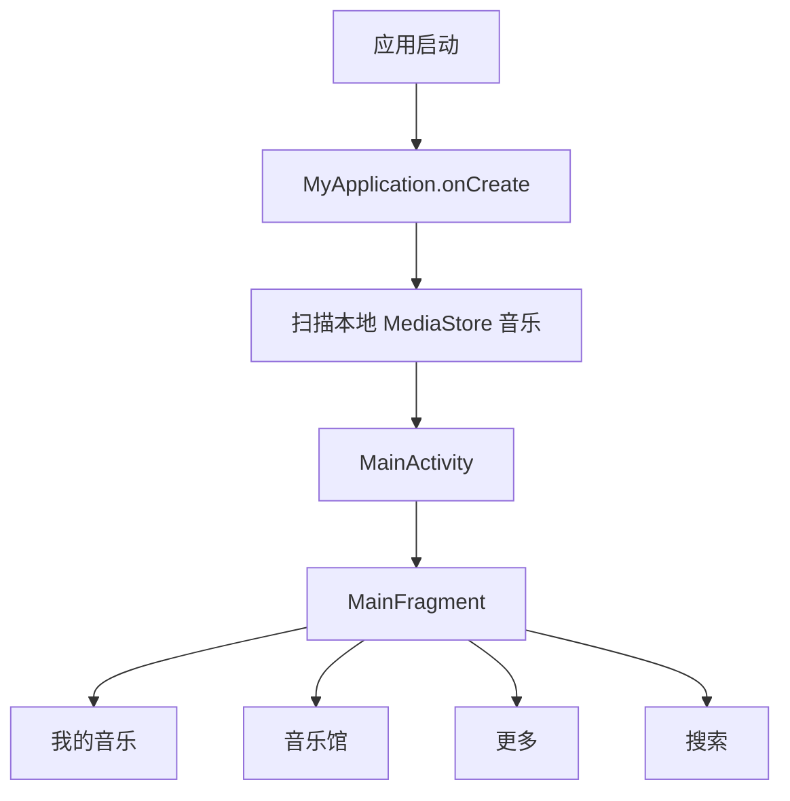

`MainFragment` 通过 `ViewPager + RadioGroup` 维护四个主 Tab：

- 我的音乐：本地音乐入口、无网络提示入口
- 音乐馆：精选、推荐歌单、热歌榜、新歌榜、经典老歌榜、网络歌曲榜
- 更多：偏静态页面
- 搜索：展示热门搜索标签

## 当前播放链路

播放相关代码集中在：

- `PlayerController`
- `MusicPlayService`
- `MainActivity`
- `PlayerActivity`
- `AlbumFragment`
- `MyApplication`

当前播放流程如下：

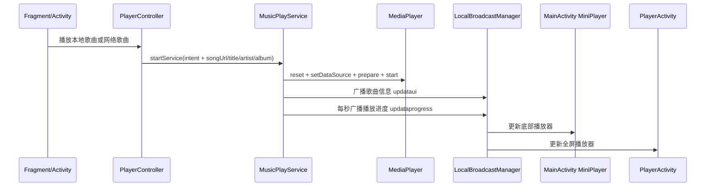

当前设计的核心特征是：

- 播放器状态大量保存在 `MyApplication` 静态变量中
- Service 通过 `LocalBroadcastManager` 通知 UI
- `MediaPlayer.prepare()` 同步执行，网络播放时有阻塞风险
- 播放进度由 `Timer` 每秒轮询
- 本地歌曲和网络榜单歌曲使用不同的全局列表维护

## 当前数据来源

本地音乐：

- 使用 `MediaStore.Audio.Media.EXTERNAL_CONTENT_URI` 扫描本地音乐
- 数据保存到 `MyApplication.mlstMediaStoreSong`
- 没有持久化缓存，也没有 Repository 层

网络音乐：

- 使用旧百度音乐接口：`http://tingapi.ting.baidu.com/v1/restserver/ting`
- 使用 Jsoup 抓取 `http://music.baidu.com/` 首页、歌单页、热门搜索
- 网络请求使用 `HttpURLConnection + ThreadTask + Handler`

## 当前主要问题

当前项目存在几类结构性问题：

1. 构建系统过旧：Gradle 2.14.1 + Android Gradle Plugin 2.2.3，已经无法在当前 JDK 21 下运行。
2. 架构层次不清：UI、业务逻辑、数据来源、播放控制、全局状态互相耦合。
3. 全局静态状态过多：`MyApplication` 承担了状态容器、数据缓存和上下文持有等多种职责。
4. 网络层不可维护：手写 HttpURLConnection，GET/POST 处理不规范，错误处理弱。
5. 异步模型混乱：AsyncTask、Thread、Timer、Handler、线程池混用。
6. 播放能力落后：直接使用 MediaPlayer，缺少通知栏、音频焦点、耳机事件、生命周期感知等能力。
7. UI 技术栈过时：XML + Fragment + ViewPager，后续扩展成本高。
8. 权限处理不完整：缺少 Android 6.0+ 运行时权限、Android 13+ 媒体权限适配。
9. 百度音乐旧接口可能不可用：需要把网络音乐源抽象出来，避免数据源失效拖垮整体架构。

# 三、需求补充和设计原则

基于你的原始要求，我建议补充以下约束，让后续改造更稳：

## 构建系统补充

本地检查结果如下：

```text
当前 Gradle wrapper: gradle-2.14.1-all.zip
系统 Gradle: 未安装
当前 JDK: OpenJDK 21.0.11
本地 JDK 目录:
- /usr/lib/jvm/java-1.21.0-openjdk-amd64
- /usr/lib/jvm/java-21-openjdk-amd64
```

因此升级策略建议是：

- 不依赖系统 Gradle，因为本地没有安装全局 Gradle。
- 使用 Gradle Wrapper 升级到当前 Gradle 官方 current 版本：`9.5.1`。
- JDK 统一使用本地已安装的 JDK 21：`21.0.11`。
- Android Gradle Plugin 使用稳定版而不是 alpha 版。当前 Maven 元数据中 AGP 最新稳定版为 `9.2.1`。

建议版本基线：

| 类型 | 建议版本 | 说明 |
|---|---:|---|
| JDK | 21.0.11 | 本地已安装，作为工程 Java toolchain 基线 |
| Gradle Wrapper | 9.5.1 | 当前 Gradle 官方 current 版本 |
| Android Gradle Plugin | 9.2.1 | 当前稳定版，避免使用 9.3 alpha |
| Kotlin | 2.4.0 | 当前稳定版 |
| Compose BOM | 2026.05.01 | 当前稳定版 |
| Room | 2.8.4 | 当前稳定版 |
| DataStore Preferences | 1.2.1 | 当前稳定版，避免 alpha |
| Lifecycle ViewModel Compose | 2.10.0 | 当前稳定版 |
| Navigation3 Runtime/UI | 1.1.2 | 当前稳定版，用于单 Activity Compose 导航 |
| Lifecycle ViewModel Navigation3 | 2.10.0 | Navigation3 ViewModel 集成 |
| ktor | 3.5.0 | 当前稳定版 |
| Hilt | 2.59.2 | 推荐作为依赖注入方案 |
| Hilt Navigation 集成 | 按 Navigation3 实际 API 适配 | 优先用 Hilt ViewModel + Navigation3 生命周期集成，避免绑定 Navigation Compose 旧方案 |

## 应用包名补充

补充要求确认：应用包名统一修改为：

```text
com.sharpcj.dreammusic
```

迁移时需要同时处理：

- Gradle `namespace`
- Gradle `applicationId`
- AndroidManifest 中旧 package/组件引用
- Kotlin 源码包路径
- Hilt、Room、Media3 Service 等生成代码相关包路径
- 测试代码包路径
- 旧 Java 包 `com.example.sharpcj.dreammusic` 到新包名 `com.sharpcj.dreammusic` 的迁移

建议新代码全部放在 `app/src/main/java/com/sharpcj/dreammusic` 下，旧 Java 代码在迁移阶段可以短期保留，最终统一删除或迁移。

## 技术选型补充

你的要求中没有明确播放器底层。考虑这是音乐播放器，建议补充引入 Jetpack Media3：

- 使用 `androidx.media3:media3-exoplayer` 替代原始 `MediaPlayer`
- 使用 `androidx.media3:media3-session` 承载媒体会话
- 使用 `MediaSessionService` 支持后台播放、通知栏控制、系统媒体控制中心

图片加载也需要补充：

- Compose 中推荐使用 Coil Compose，加载专辑封面、榜单封面、轮播图
- Coil 不是 Jetpack 组件，但在 Compose 生态里非常常用，替代 Picasso/xUtils 更合适

依赖注入建议：

- 使用 Hilt 管理 Repository、UseCase、Room Database、ktor HttpClient、DataStore、播放器控制器
- Hilt 不是 Jetpack 组件本身，但与 AndroidX/Navigation3/Lifecycle 集成成熟，能显著降低手动依赖管理成本

## 架构原则

后续改造遵循这些原则：

1. UI 不直接访问网络、数据库、MediaStore 或播放器 Service。
2. ViewModel 只暴露 `StateFlow` / `SharedFlow`，Compose 只负责渲染状态和发送用户意图。
3. Repository 负责聚合本地数据源和远程数据源。
4. 播放器状态独立建模，不再挂在 `MyApplication` 静态字段上。
5. Room 只保存适合持久化的数据，例如本地音乐索引、播放历史、收藏、歌单缓存。
6. DataStore 保存轻量配置，例如播放模式、主题、首次启动标记、最近播放来源。
7. 网络音乐源必须被接口化，避免某个外部接口失效影响整个 App。
8. 所有耗时操作使用协程，不再使用 AsyncTask、Thread、Timer、Handler 自行调度。
9. UI 全面迁移 Compose，旧 XML/Fragment 最终删除。
10. 每一层都有清晰边界，便于后续测试和替换实现。


## Google 官方架构和 NowInAndroid 对齐补充

补充要求确认：应用采用 Google 官方最新推荐架构，并参考官方示例 NowInAndroid。这里不是简单照搬 NowInAndroid 的业务，而是吸收它的工程组织方式和架构约束：

- 分层架构：UI layer、Domain layer、Data layer。
- 单向数据流：UI 发送事件，ViewModel 处理事件并暴露不可变 UI state。
- Repository 作为数据访问入口，屏蔽 Room、DataStore、MediaStore、ktor、Media3 等具体实现。
- Offline-first 思路：本地 Room 作为可缓存数据的单一事实来源，远程数据同步后写入本地。
- 模块化思路：参考 NowInAndroid 的 `core:*`、`feature:*`、`sync:*` 等分层方式。DreamMusic 前期可以先在单 app 模块内按同样边界组织包，待构建稳定后再拆成 Gradle 多模块。
- 使用 Kotlin、Compose、协程、Flow、Hilt、Room、DataStore、WorkManager/Media3 等现代 Android 组件。

新的架构表达应从“传统 MVVM”升级为“Google 官方架构推荐下的 MVVM/UDF”：

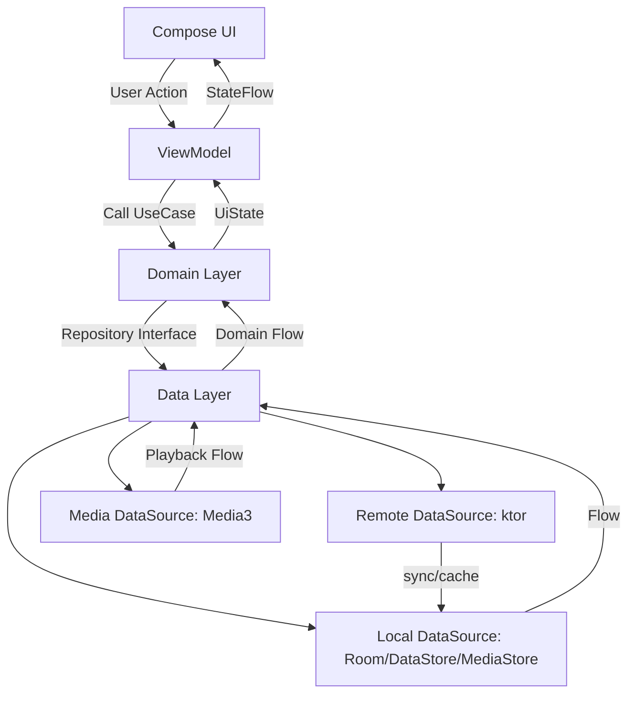

## 单 Activity 和 Navigation3 补充

补充要求确认：应用采用单 Activity 模式，页面导航使用 Jetpack Navigation3。

这意味着后续不再新增多个 Activity，也不再使用 Fragment 导航。全 App 只有一个主入口：

```text
MainActivity -> setContent -> DreamMusicApp -> NavDisplay / Navigation3 back stack
```

Navigation3 的设计重点是由应用显式持有 back stack，页面以强类型 route/key 表达。DreamMusic 建议定义：

```text
core/navigation
├── DreamMusicNavKey.kt
├── TopLevelDestination.kt
├── DreamMusicNavDisplay.kt
└── NavigationActions.kt
```

示例导航 key：

```text
LibraryNavKey
DiscoverNavKey
SearchNavKey
SettingsNavKey
PlayerNavKey(songId?)
AlbumDetailNavKey(albumId)
ArtistDetailNavKey(artistId)
PlaylistDetailNavKey(playlistId)
```

新的导航关系：

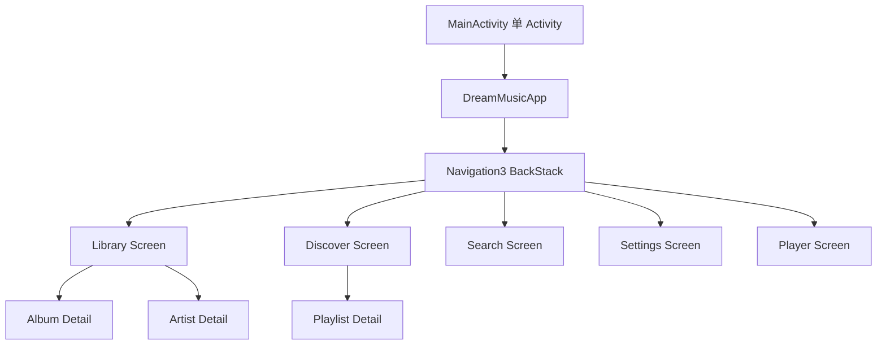

因此，原来的 `WelcomeActivity`、`PlayerActivity`、`MainFragment`、各类 Fragment 都应被 Compose destination 替代。

# 四、目标架构总览

目标架构采用 MVVM + Clean-ish 分层，不追求过度复杂，但要把边界拆清楚。

整体结构如下：

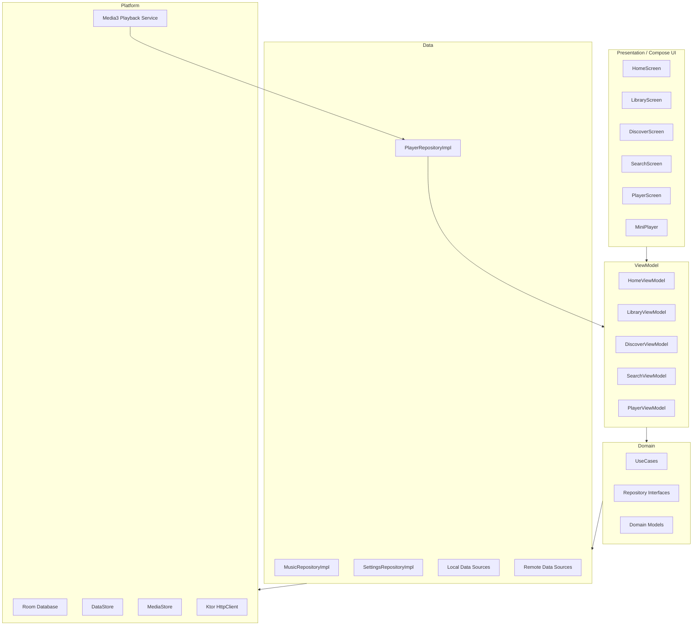

数据流采用单向流动：

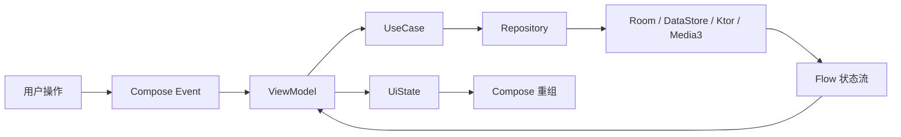

# 五、推荐模块结构

考虑这个项目会从 Java/XML 迁移到 Kotlin/Compose，并且播放、数据、网络、UI 都会重构，建议从单模块逐步演进到多模块。

第一阶段可以保留单 `:app` 模块，把包结构拆好。第二阶段再拆 Gradle module。因为一次性拆多模块 + 技术栈迁移风险较高。

最终建议模块如下：

```text
DreamMusic
├── app
│   └── App 入口、MainActivity、Navigation3 NavDisplay、主题、DI 入口
├── core:common
│   └── 通用 Result、错误模型、Dispatcher、扩展函数
├── core:model
│   └── 纯 Kotlin domain model
├── core:database
│   └── Room Database、Entity、Dao、Migration
├── core:datastore
│   └── DataStore、用户设置、播放偏好
├── core:network
│   └── ktor client、DTO、API、网络错误处理
├── core:media
│   └── Media3 播放服务、播放队列、音频焦点、通知栏
├── core:data
│   └── Repository 实现、数据源组合、mapper
├── feature:library
│   └── 本地音乐、歌手、专辑、收藏
├── feature:discover
│   └── 音乐馆、榜单、推荐歌单、精选
├── feature:search
│   └── 搜索首页、热门搜索、搜索结果
├── feature:player
│   └── 全屏播放器、迷你播放器、播放队列
└── feature:settings
    └── 播放模式、主题、缓存策略等设置
```

如果先采用单模块，包结构可以先按未来模块边界设计：

```text
app/src/main/java/com/example/sharpcj/dreammusic
├── DreamMusicApp.kt
├── MainActivity.kt
├── navigation
│   ├── DreamMusicNavDisplay.kt
│   └── Routes.kt
├── core
│   ├── common
│   ├── model
│   ├── database
│   ├── datastore
│   ├── network
│   ├── media
│   └── data
└── feature
    ├── home
    ├── library
    ├── discover
    ├── search
    ├── player
    └── settings
```

这样做的好处是，前期迁移成本较低，后期拆模块时路径和职责已经稳定。

# 六、核心分层设计

## Presentation 层

Presentation 层使用 Jetpack Compose，不再使用 XML、Fragment、Adapter、ViewHolder。

主要组成：

- `MainActivity`：只负责设置 Compose 内容和系统窗口配置
- `DreamMusicNavDisplay`：负责 Navigation3 页面导航
- `Screen`：页面级 Composable
- `Component`：可复用 UI 组件
- `ViewModel`：持有页面状态、处理用户事件
- `UiState`：不可变状态对象
- `UiEvent`：一次性事件，例如 Toast、导航、错误提示

示例页面：

```text
feature/library
├── LibraryScreen.kt
├── LibraryViewModel.kt
├── LibraryUiState.kt
├── LibraryAction.kt
└── components
    ├── LocalSongList.kt
    ├── ArtistSection.kt
    └── AlbumSection.kt
```

Compose 页面不直接知道 Room、ktor、MediaStore、Media3 的存在。

## ViewModel 层

ViewModel 通过 UseCase 或 Repository 获取数据，并暴露 `StateFlow`。

职责：

- 页面状态组装
- 加载状态、错误状态、空状态处理
- 调用业务用例
- 接收播放器状态流并映射到 UI 状态

不做的事情：

- 不直接发网络请求
- 不直接操作 Room Dao
- 不直接访问 MediaStore
- 不直接控制 ExoPlayer 实例

## Domain 层

Domain 层保存业务模型和用例，尽量不依赖 Android 框架。

核心模型建议：

```text
Song
Album
Artist
Playlist
PlaybackQueue
PlaybackState
PlayMode
SearchKeyword
MusicSource
```

UseCase 示例：

```text
ObserveLocalSongsUseCase
RefreshLocalMusicUseCase
ObservePlayQueueUseCase
PlaySongUseCase
PausePlaybackUseCase
SkipToNextUseCase
ChangePlayModeUseCase
ObserveSettingsUseCase
SearchSongsUseCase
LoadBillboardUseCase
```

## Data 层

Data 层负责 Repository 实现。

Repository 建议拆分为：

```text
MusicLibraryRepository
DiscoverRepository
SearchRepository
PlaybackRepository
SettingsRepository
```

它们分别组合不同数据源：

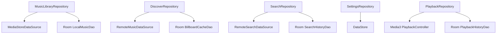

## Platform 层

Platform 层承接具体 Android 能力和第三方能力：

- Room：结构化本地数据
- DataStore：轻量用户偏好
- MediaStore：读取设备本地音频
- ktor：远程 HTTP 请求
- Media3：播放服务和媒体会话
- Coil：图片加载

# 七、数据存储设计

## Room 存储范围

Room 适合保存可查询、可关联、可缓存的数据。

建议表结构：

```text
songs
artists
albums
playlists
playlist_songs
playback_history
favorite_songs
remote_billboard_cache
search_history
```

核心实体关系：

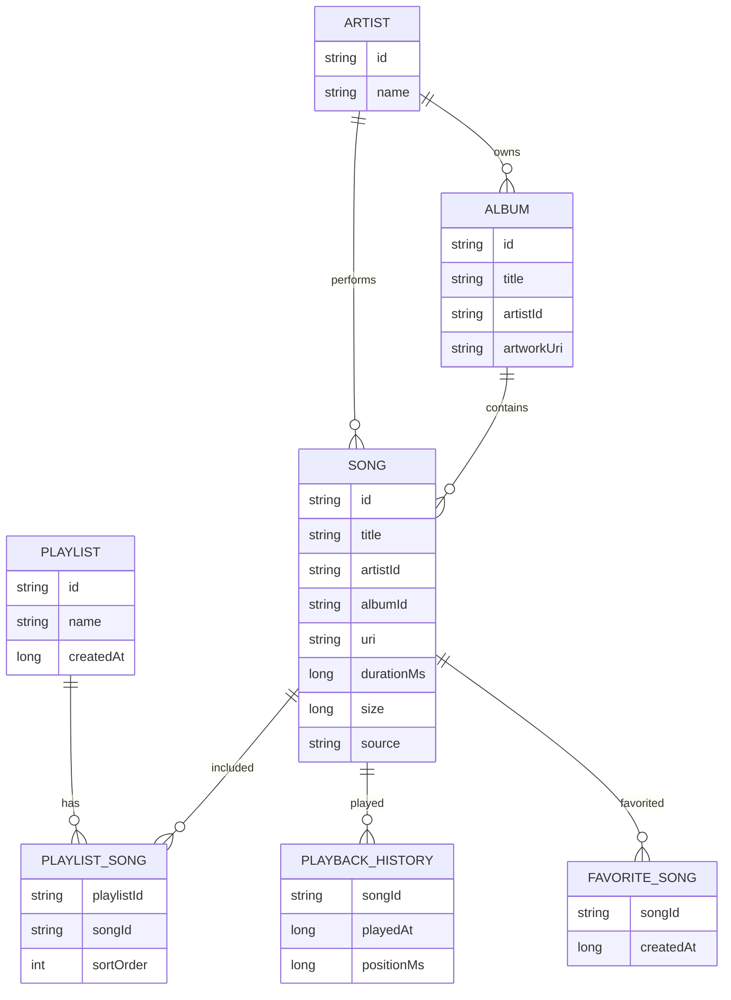

本地音乐扫描建议流程：

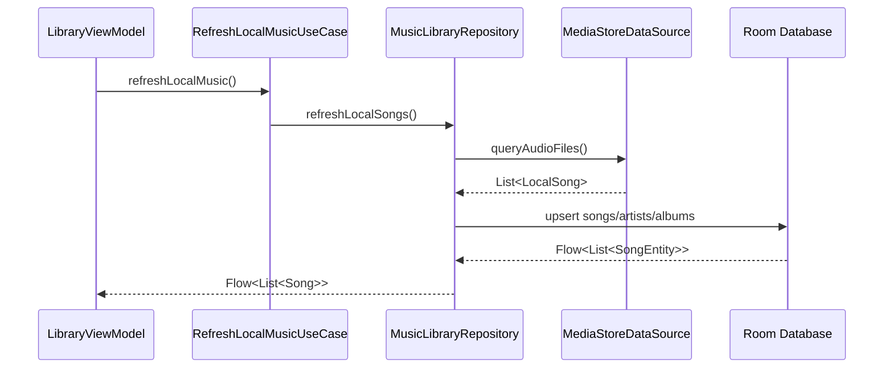

## DataStore 存储范围

DataStore 用来保存轻量偏好，不存大列表。

建议保存：

```text
play_mode: LIST_LOOP / SINGLE_LOOP / SHUFFLE
last_played_song_id: String?
last_playback_position_ms: Long
theme_mode: SYSTEM / LIGHT / DARK
first_launch_completed: Boolean
library_sort_type: TITLE / ARTIST / DATE_ADDED
network_source_enabled: Boolean
```

# 八、网络层设计

网络层使用 ktor，不再使用 HttpURLConnection。

建议结构：

```text
core/network
├── DreamMusicHttpClient.kt
├── NetworkResult.kt
├── NetworkExceptionMapper.kt
├── dto
│   ├── BillboardDto.kt
│   ├── SongLinkDto.kt
│   ├── SearchSuggestDto.kt
│   └── PlaylistDto.kt
└── datasource
    ├── RemoteMusicDataSource.kt
    ├── KtorRemoteMusicDataSource.kt
    └── HtmlMusicPageDataSource.kt
```

因为原项目依赖百度音乐旧接口和网页抓取，建议把网络音乐源抽象成接口：

```text
RemoteMusicDataSource
├── getBillboard(type, page, pageSize)
├── getSongPlayableUrl(songId)
├── getHotSearchKeywords()
├── getFeaturedBanners()
└── getRecommendedPlaylists()
```

后续如果百度音乐接口失效，可以新增另一个实现，而不影响 UI 和播放器。

网络数据流：

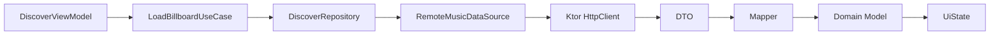

# 九、播放架构设计

播放层建议从 `MediaPlayer + Service + Broadcast` 迁移到 `Media3 + MediaSessionService + Flow`。

目标结构：

```text
core/media
├── DreamMusicPlaybackService.kt
├── PlaybackController.kt
├── MediaItemMapper.kt
├── PlaybackStateObserver.kt
├── AudioFocusHandler.kt
└── NotificationConfig.kt
```

播放关系如下：

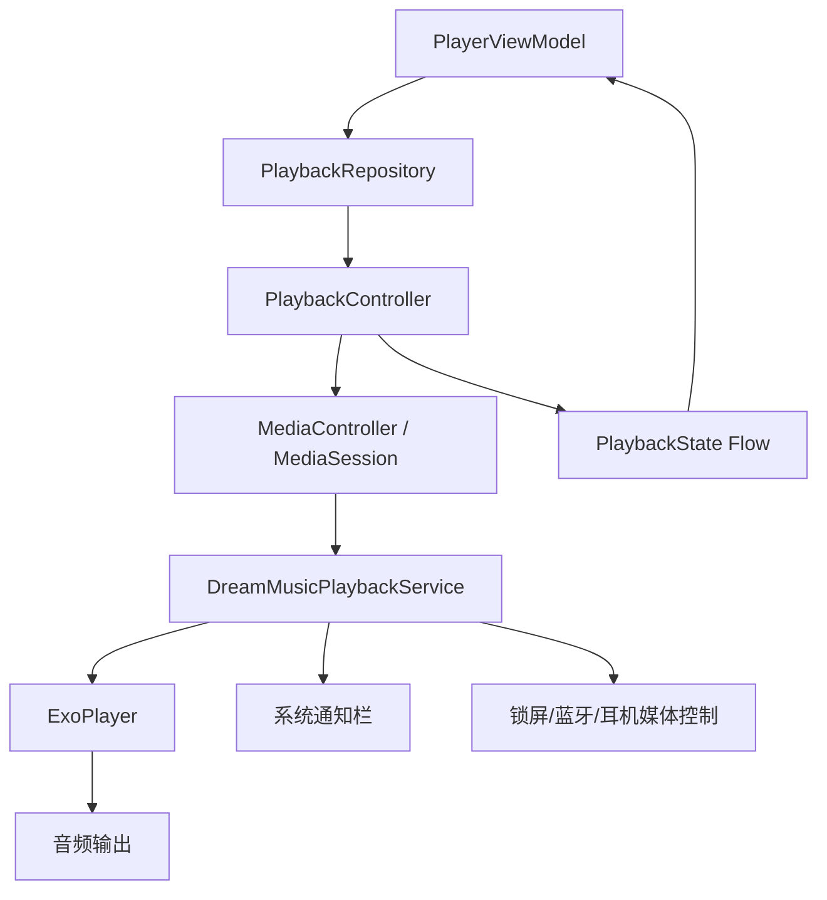

播放状态不再放在 `MyApplication`，而是建模为：

```text
PlaybackUiState
├── currentSong: Song?
├── isPlaying: Boolean
├── durationMs: Long
├── positionMs: Long
├── bufferedPositionMs: Long
├── playMode: PlayMode
├── queue: List<Song>
└── error: PlaybackError?
```

播放控制统一走 `PlaybackController`：

```text
play(song)
pause()
resume()
seekTo(positionMs)
skipToNext()
skipToPrevious()
setQueue(queue, startIndex)
setPlayMode(mode)
```

原来的 MainActivity 底部播放器和 PlayerActivity 全屏播放器，迁移后都订阅同一份播放状态：

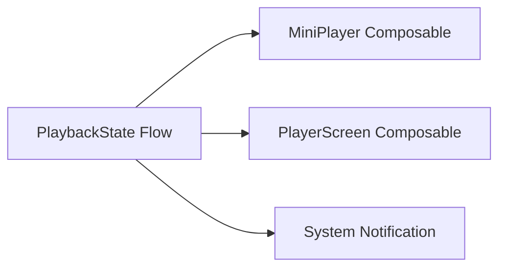

# 十、UI 和导航设计

Compose 页面建议如下：

```text
RootScaffold
├── TopAppBar
├── Navigation3 NavDisplay
│   ├── LibraryRoute
│   ├── DiscoverRoute
│   ├── SearchRoute
│   ├── SettingsRoute
│   └── PlayerRoute
├── MiniPlayer
└── BottomNavigationBar
```

新的主导航不再照搬原来的 RadioGroup，而使用 Jetpack Navigation3 + Material3 NavigationBar。

页面结构：

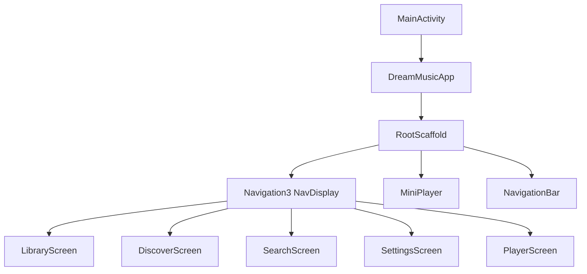

建议主 Tab：

- 本地音乐：替代“我的音乐”中的本地入口，直接强化本地库能力
- 音乐馆：保留榜单、精选、推荐歌单
- 搜索：保留热门搜索，补全搜索结果
- 设置：替代原来的“更多”，把播放模式、主题、缓存等放进去

也可以保留原文案：我的音乐、音乐馆、搜索、更多。技术上不受影响。

# 十一、权限与系统适配

原项目只声明了 `WRITE_EXTERNAL_STORAGE`，新版本需要按 Android 版本适配。

建议权限策略：

| Android 版本 | 权限策略 |
|---|---|
| Android 13+ | 使用 `READ_MEDIA_AUDIO` |
| Android 12 及以下 | 使用 `READ_EXTERNAL_STORAGE` |
| Android 10+ | 避免直接文件路径操作，优先使用 content uri |
| 后台播放 | 使用 Media3 Session + 前台服务通知 |

本地音乐页面首次进入时请求权限。用户拒绝后展示空状态和引导，不在 Application 启动阶段直接扫描，避免无权限崩溃。

新的本地音乐加载流程：

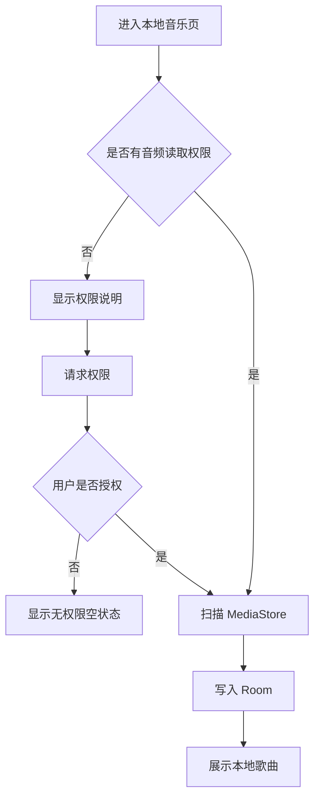

# 十二、迁移策略

这类改造跨度很大，不建议一次性全删重写。建议分阶段推进。

## 阶段目标

| 阶段 | 目标 | 主要产出 |
|---|---|---|
| 阶段 0 | 建立现代构建基线 | Gradle/JDK/AGP/Kotlin 升级，项目能编译 |
| 阶段 1 | 引入 Compose 壳 | MainActivity Compose 化，建立主题和导航 |
| 阶段 2 | 建立数据层 | Room、DataStore、Repository、UseCase 基础落地 |
| 阶段 3 | 本地音乐迁移 | MediaStore + Room + LibraryScreen |
| 阶段 4 | 播放层迁移 | Media3 Service、播放队列、迷你播放器、全屏播放器 |
| 阶段 5 | 网络层迁移 | ktor、榜单、热门搜索、歌单、缓存 |
| 阶段 6 | 删除旧代码 | 移除 Java/XML/Support Library/旧工具类 |
| 阶段 7 | 完善体验 | 权限、错误、空状态、主题、播放历史、收藏 |

## 推荐迁移路径

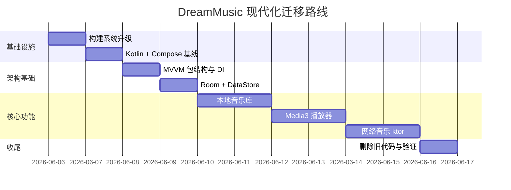

# 十三、旧功能到新架构映射

| 原功能/类 | 新设计 |
|---|---|
| `MyApplication.mlstMediaStoreSong` | `Room songs` + `MusicLibraryRepository.observeLocalSongs()` |
| `MyApplication.isPlayerPlaying` | `PlaybackStateFlow.isPlaying` |
| `MyApplication.localPositionInlist` | `PlaybackQueue.currentIndex` |
| `MyApplication.lstNetSong` | `DiscoverRepository` + `Room remote_billboard_cache` |
| `LocalMusicUtils` | `MediaStoreDataSource` |
| `BaiduMusicUtils` | `RemoteMusicDataSource` + ktor 实现 |
| `HttpNet` | `Ktor HttpClient` |
| `MusicPlayService` | `DreamMusicPlaybackService : MediaSessionService` |
| `PlayerController` | `PlaybackController` + `PlaybackRepository` |
| `LocalBroadcastManager` | `StateFlow` / `SharedFlow` |
| `MainFragment` | `RootScaffold + Navigation3 NavDisplay` |
| `PlayerActivity` | `PlayerScreen` |
| `AlbumFragment` | `AlbumArtwork` Composable |
| `CommonAdapter/ViewHolder` | LazyColumn / LazyVerticalGrid |
| `AsyncTask/ThreadTask/Timer` | Kotlin 协程 + Flow |
| `Picasso/xUtils BitmapUtils` | Coil Compose |
| `SharedPreferences/SystemUtil` | Jetpack DataStore |

# 十四、风险点和处理方案

## 构建升级风险

从 Gradle 2.14.1 到 9.5.1 跨度极大，旧的 `compile`、`testCompile`、Support Library、buildToolsVersion 写法都会失效。

处理策略：

- 不做机械升级旧依赖，而是建立新的现代 Gradle 配置。
- 优先保证空壳 Compose App 可编译。
- 再逐步迁移功能。

## 旧百度音乐接口风险

原项目依赖的百度音乐接口很老，可能已经失效。

处理策略：

- 网络音乐源接口化。
- ktor 层实现时先保留旧接口适配，但不要把它写死到 UI。
- 如果接口不可用，Discover 页面展示明确错误和空状态。
- 后续可以替换为新的合法音乐数据源。

## 播放器迁移风险

Media3 相比 MediaPlayer 结构更完整，但迁移成本更高。

处理策略：

- 先支持本地播放。
- 再接入远程 URL 播放。
- 最后补充通知栏、播放队列、播放模式、历史记录。

## 一次性重写风险

技术栈全部替换，容易出现“大改后不可运行”的情况。

处理策略：

- 每个阶段都保持可编译。
- 每个阶段都有验证命令。
- 先搭新壳，再迁功能，最后删旧代码。

# 十五、后续实施验收标准

后续真正开始改造时，每个阶段需要有明确验收标准。

## 构建基线验收

- `./gradlew --version` 能显示 Gradle 9.5.1
- `./gradlew :app:assembleDebug` 能成功
- 工程使用 JDK 21 toolchain
- 不再使用 `compile` / `testCompile` 旧依赖声明

## Compose 基线验收

- `MainActivity.kt` 使用 `setContent {}`
- 使用 Material3 Theme
- App 能展示底部导航和空页面
- 不依赖旧 `MainFragment`

## 本地音乐验收

- 能请求音频读取权限
- 授权后能扫描本地音乐
- 扫描结果写入 Room
- LibraryScreen 能通过 Compose 展示歌曲列表

## 播放器验收

- 点击本地歌曲后能播放
- MiniPlayer 能显示当前歌曲和播放状态
- PlayerScreen 能控制播放、暂停、进度跳转、上一首、下一首
- 后台播放有通知栏控制

## 网络音乐验收

- ktor 能请求榜单或热门搜索接口
- 网络异常有明确错误状态
- 榜单结果能缓存到 Room
- 点击网络歌曲能进入播放流程

# 十六、建议的下一步

下一步可以进入“实施计划”阶段，但仍然不直接动代码。建议先生成一份更细的任务拆解文档，按阶段列出：

- 要改哪些 Gradle 文件
- 要删除哪些旧依赖
- 要新增哪些 Kotlin/Compose/Jetpack 依赖
- 每一步改完运行什么命令验证
- 每个阶段是否保留旧代码兼容
- 每个阶段的回滚点

等你确认这份概要设计方向后，我再开始进入第一阶段：升级 Gradle/JDK/AGP/Kotlin 构建基线。